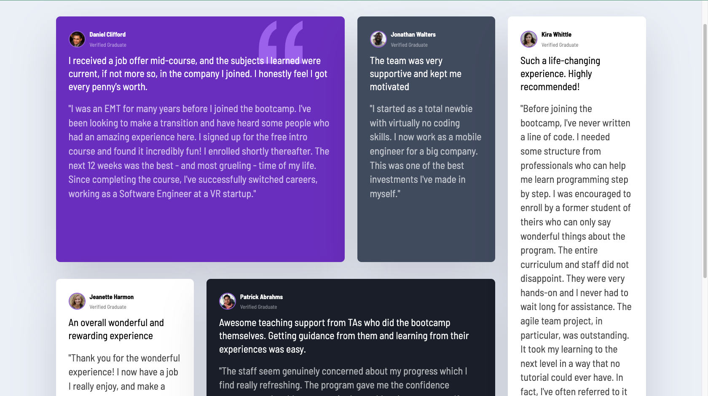

# Pick Game

## Table of contents

- [Overview](#overview)
  - [Screenshot](#screenshot)
  - [Links](#links)
- [My process](#my-process)
  - [Built with](#built-with)
  - [What I learned](#what-i-learned)
  - [Continued development](#continued-development)
- [Author](#author)

## Overview

### Screenshot




This is project's simple view...

### Links

- Live Site URL: [Live site](https://morcicek.github.io/Grid-Project/)

## My process

### Built with

- Semantic HTML5 markup
- CSS custom properties
- Flexbox
- CSS Grid

### What I learned

This project is about mostly CSS Grid.Also I reinforced my knowledge about CSS and HTML and practiced for flexbox and the other elements...

To see how you can add code snippets, see below:

```html
<header class="card__header">
  
  <div>
    <h3>Daniel Clifford</h3>
    <p>Verified Graduate</p>
  </div>
</header>
```

```css
.testimonials {
  max-width: 1440px;
  margin: 100px auto;
  padding: 20px;
  display: grid;
  grid-template-columns: repeat(4, 1fr);
  gap: 30px;
}

.card:nth-of-type(1) {
  grid-column: 1 / 3;
}

.card:nth-of-type(4) {
  grid-column: 2 / 4;
  grid-row: 2;
}

.card:nth-of-type(5) {
  grid-column: 4;
  grid-row: 1 / 3;
}
```

### Continued development

I still work on Web Development and want to build more project with CSS Grid and Flexbox.

## Author

- Lınkedin - [Mehmet Cevat Morcicek](https://www.linkedin.com/in/mehmet-cevat-morcicek-b50a29178/)
- Twitter - [@morcicek_m](https://twitter.com/home?lang=en)
